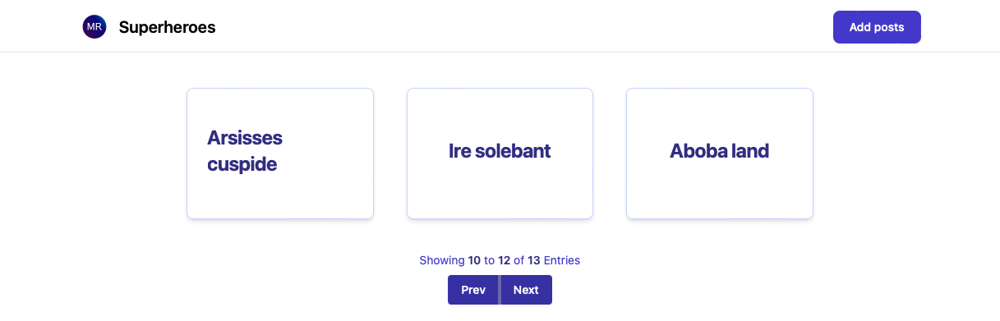

# place-for-your-thoughts
This project represents a website where you can write a blog using markdown



## Running service

First create `.env` file in project directory and place there:
```markdown
LOGIN=yourlogin
PASSWORD=yourpassword
```

Then run in terminal:
```bash
make
```

Now type localhost:8888 in your browser and start using service